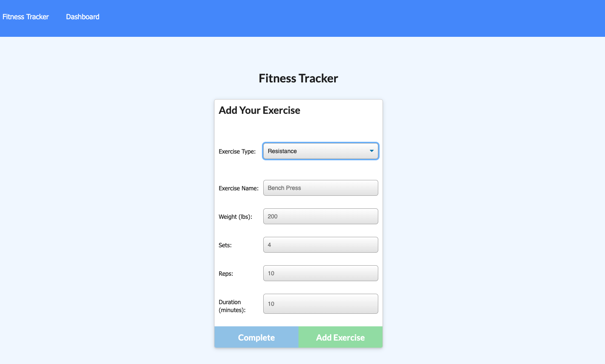

# WorkoutTracker
[](https://opensource.org/licenses/MIT)

Link to deployed site on Heroku: https://tracker-fitness-workouts.herokuapp.com/

# Description
This application tracks workouts made up of cardio and resistance exercises. It will show up total distance for the cardio exercises, total weight lifted as well as time spent working out in the dashboard stats sight. This application was interesting to work on to be able to use Mongo database and the Mongoose schema as well as to keep practing handling routes with Express. I also enjoyed learning about the charts.js. It was challenging to deploy to Heroku but I was able to figure out how to fix the deployment issues. For future versions, I would like to add animations to the charts and show data differently. 

## Table of Contents

- [Installation](#installation)
- [Usage](#usage)
- [Contributing](#contributing)
- [Tests](#tests)
- [Screenshots](#screenshots)
- [License](#license)
- [Questions](#questions)
- [Acknowledgments](#acknowledgments)

### Installation
After downloading this repository, go into the folder of this project. Then run npm install or i. 

### Usage
Make sure to have MongoDB installed. Then you can use run npm run seed to load the database, then run npm watch to run nodemon or run npm start to just run the server.js if there are no updates expected to be made. You can open Insomnia Core to enter any route create in the /routes/api directory. Using GET,POST,PUT and DELETE functions of Insomnia you can view and update the database. You can also use a program such as ROBO 3T to view the MongoDB collection.

You can also visit the Heroku link above to see the deployed site.

### Contributing
Feel free to fork or clone this repo and make your own versions.

### Tests
None.


###  Screenshots 
Adding a Workout

View of the Dashboard


###  License

Copyright &copy; 2021 Edgar Ortega

This project is licensed under the terms of the <a href="https://opensource.org/licenses/MIT" target= "_blank" > MIT </a> license.

### Questions

Send questions to edort93@gmail.com or visit <a href="https://github.com/edgarO93" target= "_blank" >my profile </a><br>

### Acknowledgments

```
I would like to thank online resources such as W3 schools, MDN Web Docs, and Stack Overflow.
```